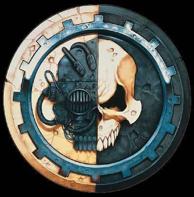
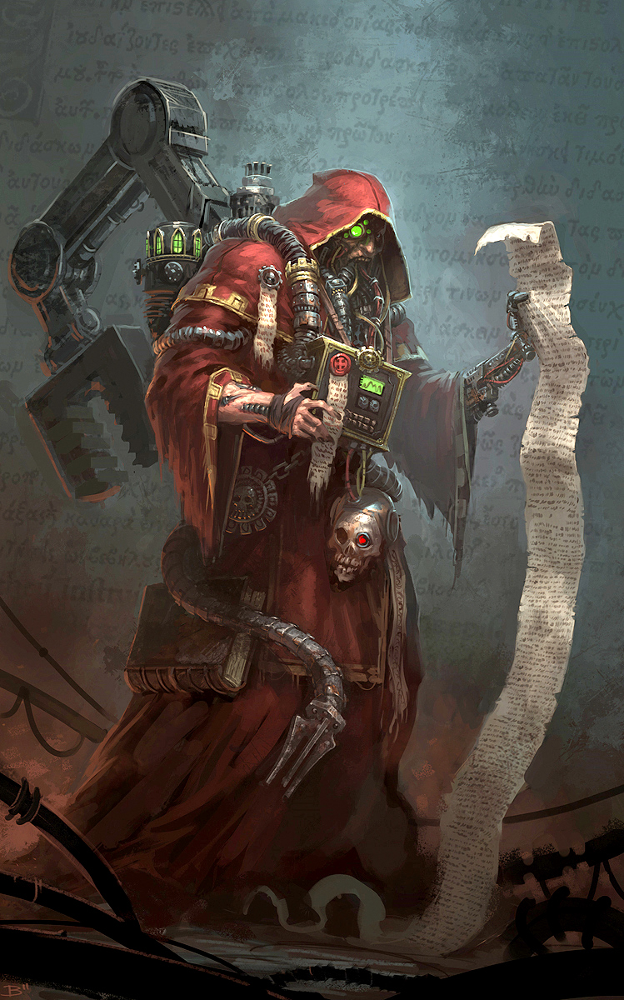
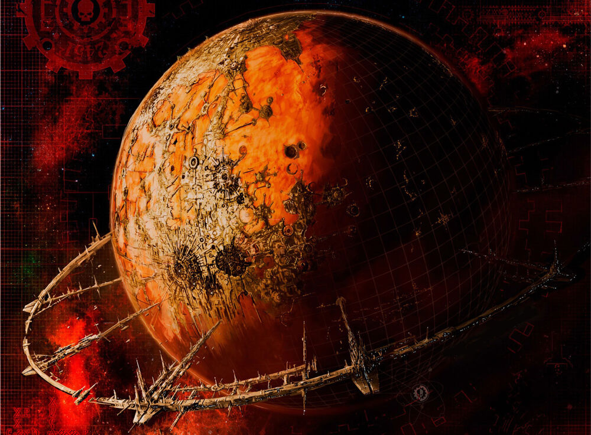
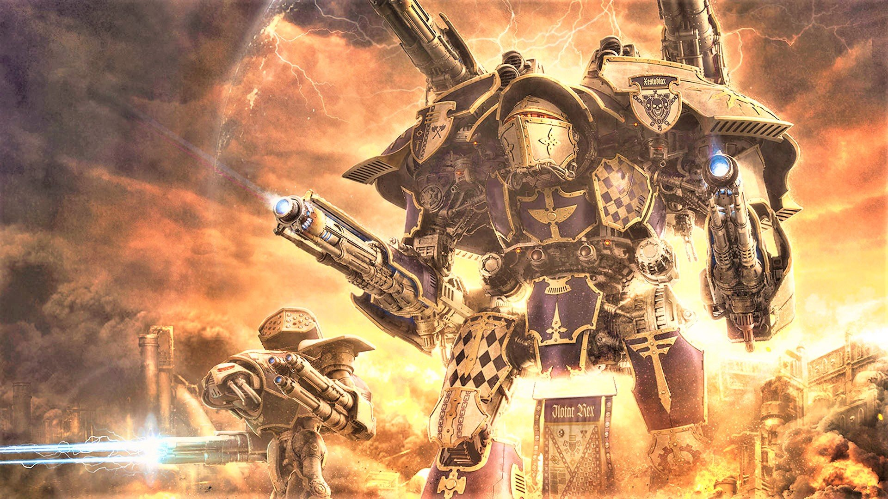
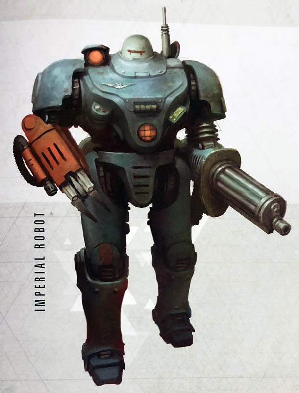
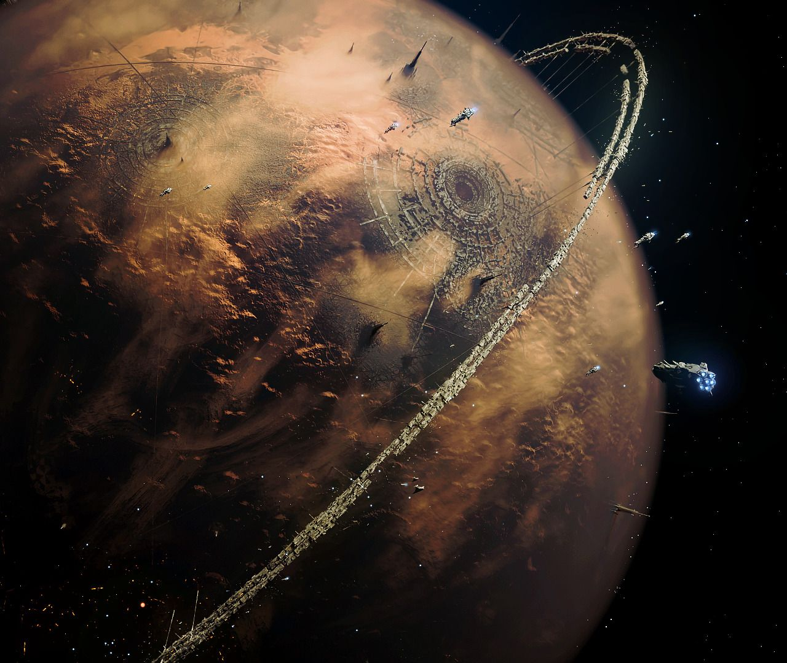

# In the Grim-Darkness of the 41st-millenium...

"There is no truth in flesh, only betrayal.
There is no strength in flesh, only weakness.
There is no constancy in flesh, only decay.
There is no certainty in flesh but death." 
— Credo Omnissiah

The Mechanicus does NOT have the technology. They haven't been living on
some fancy paradise planet since pre-Fall. Mars is an anarchic nightmare
shithole the moment you leave the safe zones into the kilometres of
labyrinthine corridors beneath it full of rogue machinery, self-aware and
malevolent AI from before the Fall, and the daemon programs of the Heresy.
EVERYTHING in the databases is fucked. The databases are fragmented over
the entire surface to the extent that it would be impossible to see
one-tenth of the total files in the ludicrously extended life of a Magos
even assuming that they are completely safe to visit. They are not.

\pagebreak

{ width=250px }

The files have been corrupted into madness by the Fall, and the unleashing
of the most potent informational warfare systems ever to exist to defeat
the Iron Men. Nearly all of Mars was rendered uninhabitable, what they
live in now is built on the top of the ruins. They send archeotech
expeditions in to find shit, nearly all of them never come back. The sheer
number of rogue war machine running around in there is sufficient to
shatter the mind. Then came the Heresy, which was not earth exclusive.
Mars as the second most critical planet in the Imperium was the site of
fighting nearly as ferocious as on Terra, with Mechanicus loyalists and
Hereteks fighting tooth, nail, and mechadendrite everywhere. Ancient
machines were unleashed, viruses both normal and daemonic unleashed into
all the computer systems. Nearly every single stored record on Mars was
rendered unusable, and those that survived are half the time self-aware 
and don't like you, or daemonic and actively try to kill you.

\pagebreak

If you do manage to come back with a schematic, it is almost certainly
gibberish; if it isn't gibberish, it's probably corrupted into
uselessness. If it comes back whole it was probably malevolently fucked
with so that, instead of a Lasgun power cell, it's a fucking grenade set
to detonate the second you finish building it. Why do you think they want
off-world STCs so damned much if they had them all here? The 
Heresy is why. Off-world they only have to contend with the Fall's war and
its effects on the machinery plus twenty thousand years of degradation
with no maintenance. But at least off-world it'll probably just not work
instead of actively seek to kill you.

Why do you think they seek to placate the Machine Spirit? It's because the
thing actually exists. A trillion fragmented programs, first designed
during the during flourishing of the Golden Age of Technology and
shattered by Man in his war with the Iron Men, fell to infighting and
artifical natural selection onset by exposure to the Warp. Over the
millenia, random deviations of technological iterants grew ever more
malevolent as the effects of Warp exposure grew ever tighter. Not an
entity forthright, but a rogue AI copied into everything capable of
facilitating a program. Every computerized tech in the Imperium has
a shard of the Machine Spirit program in it. EVERYTHING. And you'd better
fucking please it or it will do everything in its power to make your day
shit. Sure, if it's a Lasgun it'll just not work or start shooting off
rounds by itself, but if you piss off a Land Raider you can say bye-bye to
half a continent. They apply these principles to things without spirits by
habit, since they're so used to dealing with tanks that if not talked to
just right might go rogue and annihilate the Manufactorum before they can
be killed.

This is why they do not like ANYONE fucking with technology, because it is
so rare to find anything that just works- it is critical it not be
compromised. That, and they do not have the actual knowledge to fuck with
it intelligently. They only can understand through experimentation, which
inevitably leads to slaughter. Pressing buttons to see what works can be
fine in a 21st-century computer, but it is a very stupid thing to do at
the helm of a 401st-century starship with the destructive power to end
solar systems. The entire knowledge base of humanity was lost. Not
forgotten, but outright lost. Everything at all, poof. Nobody knows
anything because the Fall fucked everything up and the Heresy
double-fucked it. To rebuild the theoretical framework needed to design
new technologies that don't kill everyone near them would require starting
from the ground up. They don't have the time, and they never have.

This gets on to the point of war and what it does to technology. Someone
will parrot that it makes it go much faster. Yes, it makes practical
applications of technology go much faster. It also utterly subverts all
research on the scientific theories behind those technologies. This means
that when war chugs along for a decade or two things get done. It also
means when war goes on too long, you run out of theories to turn into
technologies, and then you run out of technologies to apply. You stagnate.
When you have been fighting in a war for survival in a drastically
overextended empire, this is what happens. You are desperate for any extra
material that can possibly be produced. Half your entire military might go
rogue, smashed the half that stayed, leaving you with the tattered shreds
of a war machine to keep hold of an empire that was already reaching
straining point with an army far larger. There is no time for the sort of
applied research programs that took Man twenty-five thousand years to
develop, in a time of unprecedented growth and prosperity.

{ width=250px }

This is also why the Adeptus Mechanicus insists on cargo cultism. It's
because when you are dealing with things you barely understand because
everything you knew about them was destroyed it is the safest and most
reliable option. The rituals do not exist for mysticism, they exist
because they are the most practical means of building, repairing and
maintaining the equipment they have with the knowledge surviving. You
don't understand why pressing that button makes it go, because the manual
tried to take over your brain and the copies are all unreadable and the
research base that would let you reverse-engineer it does not exist and
cannot be built.

Why are the Tau doing so well with their technology? Because they had
peace. Eight thousand years unmolested by any enemy and they were helped
the entire time by the most advanced biological race in the galaxy. Give
the Imperium eight thousand years of peace and I can guarantee you it will
be harder than it was during the Great Crusade.

\pagebreak

Since some still don't get the idea, try this.

Build a library, fill it with all human knowledge. You take it elsewhere
when you need a book from it, but the book is only a simplified copy. You
don't understand the real book, and you don't need to. Nobody takes the
real books anywhere because why would you when there's a whole library
there?

Now that library goes rogue and the maintenance machinery starts killing
everyone anywhere near it. Where the fuck did they all come from? You
swear to god there weren't this many, and there weren't because they're
using the library's information to fight their war. The government fights
a battle that destroys the planet against these robots and tears apart the
library to stop them from using it, only to be destroyed in the process.
The library is leveled, cast into flames, every book burned and every
computer virus-laden.

Then comes a man who worked there. He talks to the few surviving library
workers, assembles their information, and starts rebuilding a city around
the library and expanding it as the librarians find little scraps of paper
and fragmented bits of files that stuck together just right to read
something. They rebuild a library from scrap on the ashes of the old. It
can't hold a candle to the glory of the old, but it is all they have.

Then the city crumbles under rebellion, turns on itself, kills its master,
and the librarians turn to rage. Half of them kill the other half and
destroy the remnants of the library- because where they're going they
won't need science. Everything burns and the city is left to a scattered
few survivors, walls open to the world, with the hungry predators
circling.

The Adeptus Mechanicus is the sole surviving librarian, desperately
scrabbling through the ashes of paper and splinters of hard drives for
anything to help him and the city he needs to survive just a second
longer.

The Imperium isn't grim because things suck by choice and could be fine if
a sensible person came along. That sensible person wouldn't survive fifty
seconds of that reality. The Imperium is grim because every single shit
decision, every single sacrifice, every single death, every single man
woman and child suffering a shit life in the worst conditions imaginable,
is the absolute best that can be done. It is a study of the worst
happening to everyone and what part of your humanity must be sacrificed
today just to stand a chance of survival, and all it asks is whether or
not it would have perhaps been better to die.

-Baron von Evilsatan
